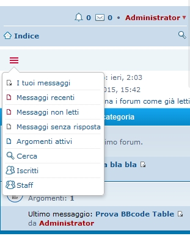

Quick Links on Navbar
============

Extensione per phpBB 3.1 per mostrare gli elementi quick link in una comoda navbar sotto quella principale e nascondere quegli nella barra.

  
`Desktop Version`

  
`Mobile Version`
  
============  

#### Requisiti
- phpBB 3.1.0 or higher
- PHP 5.3.3 or higher

## Installazione
1. [Scarica l'ultima release](https://github.com/XiradornLab/qlinknav) e estrai il contenuto.
2. Copia l'intero contenuto nella cartella `/ext/xiradorn/qlinknav/`.
3. Naviga nel PDA e recati in `Personalizzazioni -> Gestione estensioni`.
4. Trova `Top Ten Topics` in "Estensioni Disabilitate" e clicca su `Abilita`.

## Disinstallazione
1. Naviga nel PDA fino a `Personalizzazioni -> Gestione estensioni`.
2. Clicca `Disabilita` sulla estensione in questione.
3. Per una cancettazione permanete, clicca su `Cancella i dati`, quindi cancella la cartella `qlinknav`.

### License
[GNU General Public License v2](http://opensource.org/licenses/GPL-2.0)

© 2015 
- Sir Xiradorn - Lead Developer
